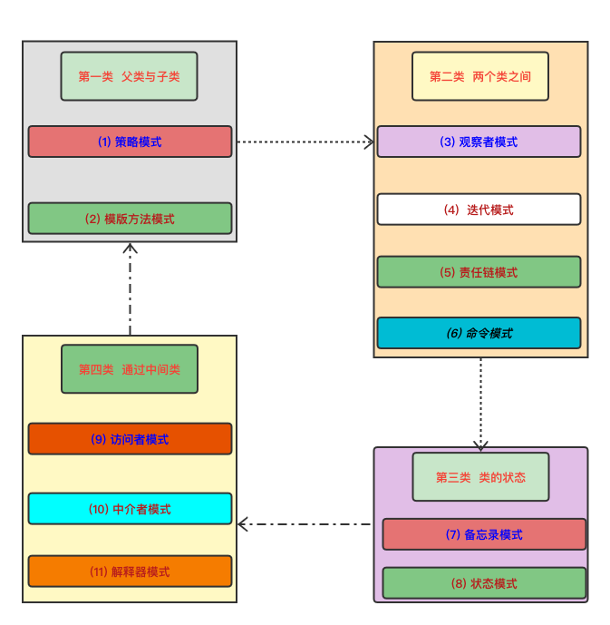

* [行为模式](Behavioral Design Patterns) [11种]

****

  

****

###### 一、父类 VS 子类
  * 1、策略     [（Strategy）模式]
  * 2、模版方法
    ###### Class [（Template Method）模式]

###### 二、两个类之间
  * 3、观察者 （Observer）模式
  * 4、迭代器   [（Iterator）模式]
  * 5、职责链   [（Chain of Responsibility）模式]  
  * 6、命令 （Command）模式

###### 三、类的状态
  * 7、备忘录 （Memento）模式
  * 8、状态     [（State）模式]

###### 四、通过中间类
  * 9、访问者 （Visitor）模式 
  * 10、中介者 （Mediator）模式 
  * 11、解释器 
     ###### Class [（Interpreter）模式]

``` hql
    总结：
        1、模板模式（Template Method）
            、解释器模式（Interpreter） 
        属于 '类行为模式';
        
        2、其他都是 '对象行为模式'。
```